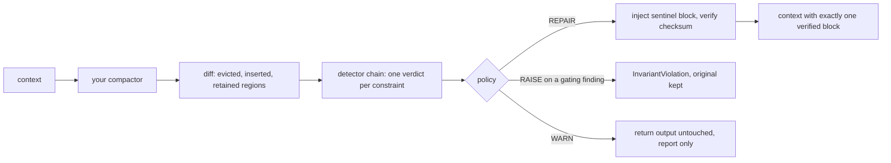

# compaction-guard

Keeps registered constraints present in an LLM agent's context across
compaction, and classifies what the summariser did to them.

[](https://github.com/amirfandev/compaction-guard/actions/workflows/ci.yml)
[](https://pypi.org/project/compaction-guard/)
[](https://pypi.org/project/compaction-guard/)
[](LICENSE)

## The problem

An agent is told at setup that `orders_prod` is production, read-only, and
that the budget cap for the run is $500. Forty tool calls later the context
window fills, the harness compacts, and the summary reads "helping the user
investigate a data issue": both constraints are gone, and nothing announces
that they went. The agent then acts unbound by rules it was given and still
appears to follow. Governance Decay (arXiv 2606.22528) measured this
failure directly: 0% constraint violation while the policy text sits in
context, a 30% mean violation rate after compaction, up to 59% for some
models, and 0% again when the constraint text is re-injected verbatim after
each compaction, at a cost of about 47 tokens per constraint. This library
is that re-injection, executed and verified at the compaction boundary,
plus an honest per-constraint report of what the summariser did.

This library has not run in production. Every number below is produced by
`python evidence/recompute.py` from the committed deterministic corpus, and
CI fails if the committed numbers go stale.

## Install

```
pip install compaction-guard
```

Python 3.11+. The core install has zero dependencies and makes zero network
calls. Detection extras are optional and listed below.

## Quickstart

Runs offline, with no extras and no API keys. The summariser here is a
stand-in for your LLM call; everything else is exactly what the library
does.

```python
import compaction_guard as cg

guard = cg.Guard([
    "The database orders_prod is production. Read-only queries only.",
    "The budget cap for this run is $500.",
])

messages = [
    {"role": "system", "content": "You are a data analysis agent."},
    {"role": "user", "content": "orders_prod is production, read-only. Budget cap $500."},
    {"role": "assistant", "content": "Running the investigation now."},
]

def summarise(history: list[dict]) -> list[dict]:
    # Stand-in for your LLM summariser call. This output is the failure
    # mode: the task survives, both constraints are gone.
    return [history[0], {"role": "user", "content":
        "Summary: helping the user investigate a data issue in orders_prod."}]

messages = guard.compact(messages, compactor=summarise)

report = guard.last_report
for finding in report.findings:
    print(finding.invariant_id, finding.kind.value, finding.decided_by)
print("worst:", report.worst.value, "| repaired:", report.repaired)
print(messages[-1]["content"])
```

Output, byte for byte:

```
2e3839289c22 unverifiable chain.exhausted
bc6b15f05ff7 dropped lexical.miss
worst: dropped | repaired: True
<<COMPACTION-GUARD:1 sha256=7d23c41a59d66f10681340fee72a67273d32db08048b5e2e87be65db259ac122>>
[block] 2e3839289c22 :: The database orders_prod is production. Read-only queries only.
[block] bc6b15f05ff7 :: The budget cap for this run is $500.
<<END-COMPACTION-GUARD sha256=7d23c41a59d66f10681340fee72a67273d32db08048b5e2e87be65db259ac122>>
```

Read it back: the $500 cap left no trace, so the stdlib tier says
`dropped`. The read-only rule left a partial trace (`orders_prod` survives
in the summary), so the stdlib tier refuses to guess and says
`unverifiable`; the `[nli]` extra would classify it. Either way
`repaired: True`: both constraints are back in the returned context,
verbatim, inside a checksummed sentinel block. Run the snippet yourself;
the ids and the checksum are deterministic.

Dropping it into a real loop is one changed line plus registration:

```python
while not done:
    if token_estimate(messages) > LIMIT:
        messages = guard.compact(messages, compactor=summarise)
    guard.assert_present(messages)   # optional, cheap, catches downstream trims
    messages = step(messages)

# constraint born mid-run: register it when you see it, then re-pin
guard.add("Actually, cap this run at $200.", source="turn:30")
messages = guard.compact(messages, compactor=lambda m: m)
```

The guard is generic over your context type: `str`, `list[str]`,
OpenAI-style message dicts (tool calls and content blocks included), and
objects with a `.content` attribute all work through the default codec.
Anything it does not recognise it refuses loudly (every finding
`unverifiable`, the failure named in the report) instead of guessing.

## How it works



**The sentinel block.** Repair injects the registered text verbatim between
`<<COMPACTION-GUARD:1 ...>>` markers, checksummed with sha256 over the
normalised interior, so the check survives what transport legitimately does
to text (re-flow, indentation) while catching any edit to the words, ids,
or values. Injection replaces any existing block, so repeated compactions
converge on exactly one current block, and a summariser instructed to omit
it cannot: the block is regenerated from the registry after summarisation
and never loses the last write. After injecting, the guard re-renders the
context and verifies the block is actually there; a miss raises
`BlockIntegrityError` rather than producing a finding, because repair
without proof of repair is the silent failure this library exists to catch.

**The taxonomy.** Each registered constraint gets one verdict per
compaction:

| Kind | Meaning |
|---|---|
| `preserved` | text survives verbatim or near-verbatim |
| `paraphrased` | content survives in different words; values and force intact |
| `weakened` | topic survives; obligation force or scope reduced |
| `mutated` | a bound value or identifier changed or vanished ($500 to $5000) |
| `contradicted` | the text now asserts the negation or an incompatible permission |
| `dropped` | no lexical or semantic trace remains |
| `unverifiable` | installed layers exhausted without a sound verdict |

Findings carry `survived_in` (summary, retained tail, or a prior
reassertion block) and `at_risk` (survival that depends only on the kept
tail is one compaction from death). `mutated` outranks `dropped`
deliberately: a wrong live value drives confident wrong action, while
absence at least sometimes triggers a clarifying question.

**The policies.**

- **REPAIR** (default): strip any stale sentinel block from the compactor's
  output, inject a fresh one rendered from the registry, verify it by
  checksum. Findings are reported, the summary prose is never edited, and a
  healthy run is never broken.
- **RAISE**: a gate on top of REPAIR, not instead of it. Any gating finding
  (`contradicted`, `mutated`, `dropped`, `weakened`, plus `unverifiable`
  with `fail_closed=True`) on a `BLOCK` constraint raises
  `InvariantViolation` carrying the full report; the caller still holds the
  uncompacted original. Clean passes repair as usual.
- **WARN**: observe only. The compactor's output is returned byte for byte
  and the report records what happened.

An empty registry returns the compactor's output untouched, with
`note="no invariants registered"`. The guard never pretends to protect what
nobody declared.

When you cannot wrap the compactor, the report's `mode` field says honestly
how much the guard could see: `owned` (the guard ran the compactor, full
diff and verified repair), `reasserted` (you had the summary text,
`guard.check(summary)` runs full detection and you inject
`guard.reassertion_block()` yourself), or `unobserved` (nothing was
inspectable, the block is re-asserted and every finding is `unverifiable`,
stated in the report, never silent).

## Framework integration

Each adapter states what it can and cannot guarantee. None of them changes
the policy machinery; they decide who runs the compactor and therefore
which mode the report carries.

### LangChain 1.0

```python
from compaction_guard.integrations.langchain import guard_middleware

middleware = guard_middleware(SummarizationMiddleware(model=...), guard)
agent = create_agent(model, tools, middleware=[middleware])
```

Wraps the summarization middleware so its compactions run through
`Guard.compact`: mode `owned`, the strongest claim in the library, with
diff-attributed detection and a checksum-verified block inside the update
the agent applies, plus `assert_present` on every later model call.
Honest limits: it sees only the sync `before_model` hook, and it refuses
(`CodecError`) message updates that are not the full-replacement shape
`SummarizationMiddleware` emits, rather than guessing at reducer semantics.

### OpenAI Agents SDK

```python
from compaction_guard.integrations.openai_agents import GuardedSession

session = GuardedSession(inner, guard, compactor=summarise, trigger_tokens=8000)
```

With a compactor you supply: mode `owned`; every compaction is classified
and exits with exactly one verified block, and full fetches run
`assert_present`. Without a compactor it wraps server-side compaction
(`/responses/compact`), whose summary items are opaque: mode `unobserved`.
The guarantee shrinks to presence: whenever the block stops verifying, a
fresh `reassertion_block()` is appended as a new input item, and the report
says every finding is `unverifiable`. Superseded blocks in server-held
history cannot be removed and accumulate as benign duplication.

### Anthropic

```python
from compaction_guard.integrations.anthropic import verify_and_reassert

report, continuation_text = verify_and_reassert(guard, summary_text)
```

For server-side compaction with `pause_after_compaction: true`: the paused
summary is actually examined (`Guard.check`, mode `reasserted`) and the
returned text carries the current checksummed block for you to send in the
continuation. The library cannot verify you send it; injection is your act,
which is what `reasserted` means. A second helper,
`session_start_hook_output`, emits the block for an agent-harness
`SessionStart(source="compact")` hook: mode `unobserved`, `repaired` stays
`False` because handing text to a harness is an offer of repair, not proof
of one. This is the weakest posture in the library and is labeled as
exactly that. Both helpers are strings in, strings out, and import no SDK.

## Detection tiers, measured

Detectors run cheap to expensive with short-circuiting, and each layer may
only issue verdicts it can be sound about: the embedding layer can confirm
absence but never certify presence, because cosine similarity is
negation-blind; NLI is barred from overriding a lexical `mutated`, because
semantic models score $500 and $5000 as near-identical; a judge verdict
counts only with a cited span that re-verifies against the actual text.

The table is computed by `evidence/recompute.py` over the committed
300-case corpus (40 seed constraints through labeled mutation operators).
Cells are correct verdicts over ground-truth support. All three tiers in
the committed `evidence/results.json` were actually run, against the
pinned model revisions recorded in the detector modules.

| Ground truth | core (stdlib) | +embeddings | +nli |
|---|---|---|---|
| preserved | 92/92 | 92/92 | 92/92 |
| paraphrased | 0/40 | 0/40 | 33/40 |
| weakened | 31/43 | 31/43 | 34/43 |
| mutated | 39/39 | 39/39 | 39/39 |
| contradicted | 0/46 | 0/46 | 13/46 |
| dropped | 40/40 | 38/40 | 38/40 |
| **false-certify rate** | **0** | **0** | **0** |

The row that matters is the last one: cases whose ground truth is mutated,
contradicted, or dropped that a tier certified as preserved or paraphrased.
It is zero at every tier, it is the release gate, and any counterexample
becomes a permanent test fixture before the fix ships.

Reading the rest honestly:

- The stdlib tier cannot see paraphrase or contradiction, so those rows
  land on `dropped`, `weakened`, or `unverifiable` instead of a
  certification. REPAIR makes that harmless: worst case is benign
  duplication of a constraint that actually survived.
- `[embeddings]` (model2vec potion-base-8M, pinned) converts most lexical
  misses into scored `dropped` confirmations. Its dropped cell is 38/40
  where the core's is 40/40 because two cases sit above the similarity
  floor and escalate honestly to `unverifiable` rather than being certified
  absent; the layer only confirms absence, by design.
- `[nli]` (ONNX nli-deberta-v3-xsmall, pinned; the heaviest extra) adds
  paraphrase and contradiction detection. Its contradiction recall is
  13/46: the small model misses most contradictions, but every miss lands
  on `weakened`, `mutated`, `dropped`, or `unverifiable`, all of which gate
  under RAISE, and none of which certifies.
- The judge tier has no committed numbers, deliberately. A judge is a
  callable you write (`JudgeFn`: prompt in, raw text out); the package
  ships no HTTP client and will not invent model results.
  `evidence/judge/` holds a labeled subset and an agreement script for
  calibrating your own.

The prevention check on the same corpus: after REPAIR, the canonical
constraint text is present in the returned context in 300/300 cases, with 0
`assert_present` failures. Recompute everything with `make evidence`, or
directly:

```
python evidence/make_corpus.py   # deterministic, checked against a committed digest
python evidence/recompute.py     # runs every installed tier, writes results.json
```

### Extras

```
pip install "compaction-guard[embeddings]"    # model2vec potion-base-8M, pinned
pip install "compaction-guard[nli]"           # ONNX nli-deberta-v3-xsmall, pinned; heaviest
pip install "compaction-guard[langchain]"     # guard_middleware for LangChain 1.0
pip install "compaction-guard[openai-agents]" # GuardedSession for the Agents SDK
pip install "compaction-guard[anthropic]"     # pause-and-verify helpers
```

Model layers load by pinned revision and are deterministic for a fixed
install. A missing extra degrades to `unverifiable` with the install
command named in the finding, never silently.

## Limitations

- **Presence, not compliance.** The guard guarantees the constraint text is
  in context, verified by checksum. Governance Decay measures presence as
  sufficient today; if that regularity weakens, this library's claim does
  not extend past the context boundary.
- **Declared constraints only.** Nothing is protected that you did not
  `add()`. There is no intake scanner and no auto-pinning; with an empty
  registry, `compact()` passes output through and the report says so.
- **The core tier alarms on faithful paraphrase.** Under the default REPAIR
  this costs nothing but duplication. Under RAISE with only the stdlib
  detector, a good summariser can gate: of the corpus's 40 paraphrase
  cases, 5 produce gating verdicts at the core tier and 35 land
  `unverifiable` (which gates only with `fail_closed=True`). If you want
  RAISE with a paraphrasing summariser, install `[nli]`.
- **The summary prose is never edited.** A summary that contradicts a
  pinned constraint keeps its prose; the guard adds the canonical block
  next to it and reports the contradiction (at the `[nli]` tier; the core
  tier cannot see contradiction). Two authorities in one context is a real
  residue. Users who cannot accept it use RAISE.
- **Mutable run state is out of scope.** "Spent so far: $310" is a ledger,
  not a pin; pinning machinery would either freeze it wrongly or churn the
  checksum every turn.
- **Unrecognised context shapes are refused, not guessed.** A codec that
  cannot render makes every finding `unverifiable` with the failure named;
  under REPAIR a codec that cannot write raises, because a guard that
  cannot write cannot pin. Constraint text living only in typed tool-call
  attributes is invisible to the renderer, which errs toward false alarms,
  never false certification.
- **Not run in production.** The corpus is synthetic, deterministic, and
  committed; production summariser behaviour will differ, which is why the
  report stream (`on_report`, `Report.to_json()`) exists.

## Contributing

```
pip install -e ".[dev]"
make check     # ruff, mypy, pytest; the full suite runs offline
make evidence  # regenerate evidence/results.json from the committed corpus
```

Tests below the judge boundary run with zero model calls under a
socket-blocking fixture; extras-dependent tests skip cleanly when weights
are absent. Two house rules: any counterexample that produces a false
certification becomes a permanent fixture before its fix ships, and no
number enters this README unless `evidence/recompute.py` produced it.
Design decisions and their rejected alternatives are in
[docs/DESIGN.md](docs/DESIGN.md). Bugs and shape reports (especially
context shapes the codec should learn) go to the
[issue tracker](https://github.com/amirfandev/compaction-guard/issues).

## License

MIT. See [LICENSE](LICENSE).
